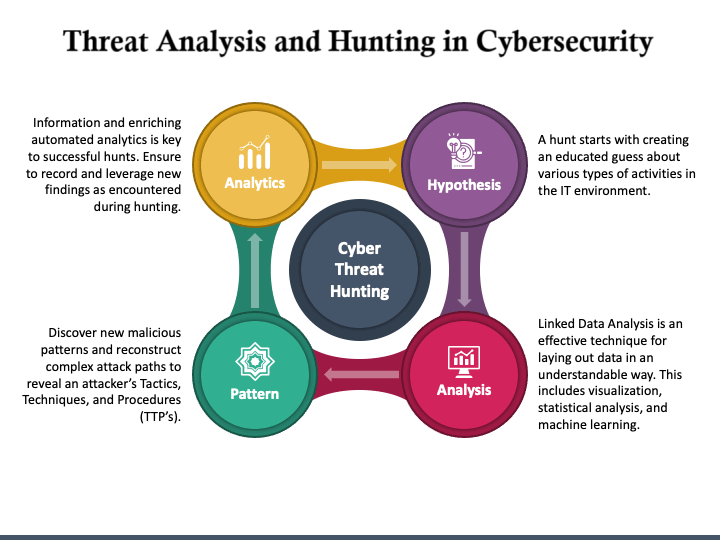

---
hide:
  - toc
---

# 📚 Cybersecurity & Cloud Engineering Series

Welcome to our multi-book series dedicated to professionals in cybersecurity, cloud architecture, and infrastructure engineering.

              
## 🔍 [Threat Analysis & Hunting](threat/index.md)
Threat hunting is a proactive approach in cybersecurity, focused on detecting threats that evade traditional security solutions. This chapter introduces core concepts, methodologies, and the value threat hunting brings to modern organizations.

➡️ [Go to Book](threat/index.md)

## [Cybersecurity](cyber/index.md)

## [Vulnerability Management](vm/index.md)
<!-- ---

## ☁️ Cloud Security Engineering

Best practices for building and defending secure cloud environments on AWS, Azure, and GCP.

➡️ [Go to Book](threat/index.md)

---

## ⚙️ Terraform Infrastructure as Code Security

Secure IaC development pipelines with Terraform, covering secrets, modules, and policy as code.

➡️ [Go to Book](threat/index.md)

--- -->

## 🛠 Contributors & License

Maintained by security professionals and open to community contributions.  
Licensed under [CC BY 4.0](https://creativecommons.org/licenses/by/4.0/).
